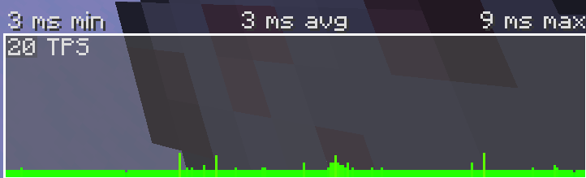
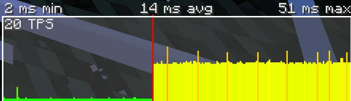
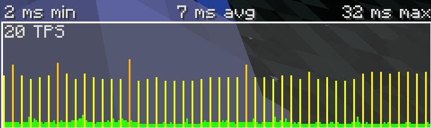
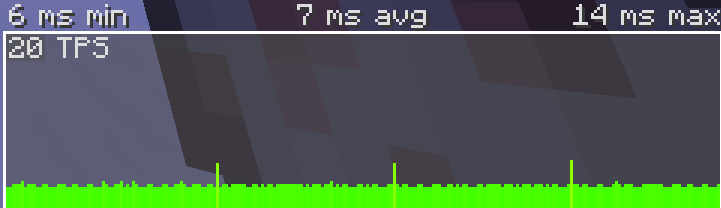

[← Retour au README](../../../README.md)

#### 🌐 Langue
[[EN]](../../advanced.md) **[FR]**

# En cours d'écriture
### Ce fichier peut contenir des erreurs ou être incomplet.

### Table des matières
- [Références et sources](#références-et-sources)
- [Introduction](#introduction)
- [Équilibrage des tâches](#équilibrage-des-tâches)


# Introduction

Ce document est une collection de méthodes et techniques avancées pouvant être utilisées pour améliorer les performances de votre datapack. Ceci n'a pas été réalisé pour être un guide complet, mais plutôt une collection de conseils et d'astuces qui peuvent être utilisées pour améliorer vos datapacks.

Contrairement au document sur [les méthodes basiques d'optimisation](./basics.md), ce document n'a pas été conçu pour être lu de haut en bas. Chaque section est indépendante des autres, et vous pouvez les lire dans l'ordre dans lequel vous voulez. C'est pourquoi il n'y a pas de marquage pour chaque section.

Le but est d'archiver des méthodes plus avancées, avec des liens vers les sources. Les méthodes peuvent être spécifiques au language mcfunction, ou des méthodes d'optimisation de programme plus générales.

# Équilibrage des tâches

L'équilibrage des tâches est une optimisation extrêmement importante pour éviter les lags, surtout quand il s'agit de grosses opérations.

En premier, soulignons une chose : Dans Minecraft, le jeu est mis à jour (MAJ) 20 fois par secondes. Chaque MAJ est appelée un tick. Pour que le jeu fonctionne cette vitesse de rafraîchissement, chque tick doit être exécuté dans un délai de 50 millisecondes maximum.

Chaque commande que l'on ajoute à notre datapack prend un certain temps pour s'exécuter, et nous avons besoin d'être sûrs que chaque tick n'excède pas ce délai. _Bien sûr, la quantité que chaque ordinateur peut calculer en un tick dépend de ce dernier, mais l'idée est la même._

Pour démontrer ce problème, j'ai fait un datapack qui brûle chaque entité exposées au ciel. Chaque tick, il teste pour chaque entité dans le jeu ; s'il est exposé au ciel, et s'il l'est, il change le NBT `Fire` pour enflammer l'entité. Dans notre exemple, la fonction de tester si l'entité est exposée au ciel est très gourmande en ressources.

### Le problème

Jetons un oeil au graphique de durée par TPS (que vous pouvez ouvrir en appuyant sur Alt+F3) dans un monde local (solo).



Ça à l'air bon ! Maintenant, activons notre datapack et allons regarder à nouveau le graphique.



Le vert c'est avant d'activer le datapack, le jaune après. C'est un mauvais signe. Sur certains ordinateurs ou serveurs, cette ligne peut aller dans le rouge et causer le serveur à fonctionner au ralenti. Cela peut aussi aller dans le rouge en fonction de la croissance d'un datapack.

Nous devons faire en sorte que le graphique soit le plus proche de celui où le datapack est désactivé.

### Trouver le problème

Nous avons besoin de comprendre si c'est possible d'optimiser ceci. Dans cet exemple, nous savons au préalable que la fonction qui détecte l'exposition des entités au ciel est le problème, elle ne peut pas être plus optimisée, puisqu'elle l'est déjà.

En revanche, il y a quand même un moyen. Quand une optimisation directe n'est plus possible, demandez-vous : est-ce que cette fonction à vraiment besoin d'être exécutée tous les ticks ?

Dans notre cas, il n'est pas nécessaire que ce soit instantané. Quelques ticks de délai ne devrait pas être dérangeant.

**Bon... commençons avec les optimisations.**

### Essayer de résoudre le problème

En premier, faisons ce la majorité des personnes font pour essayer de le résoudre : Utiliser `/schedule`. Plutôt que l'exécuter chaque tick, on peut la paramétrer pour s'exécuter tous les 5 ticks.

Changeons notre commande en la déplaçant de la fonction tick (qui s'exécute tous les ticks) à une fonction spécifique, puis en utilisant `/schedule` pour l'exécuter.

```mcfunction
#> schedule_5t.mcfunction
execute as @e[type=!player] run function example:try_sky_burn

schedule function example:schedule _5t 5t replace
```

```mcfunction
#> on_load.mcfunction
function example:schedule_5t
```

C'est déjà assez d'exécuter la finction tous les 5 ticks.

Rechargeons le datapack et regardons à nouveau le graphique.



Diriez-vous que c'est acceptable ? Non ! Peut-être que c'est bien mieux, mais regardez ces pics ! La différence entre avant et maintenant est qu'avant tous les ticks étaient lents, maintenant juste certains. Cela peut aussi causer des lags !

Il nous faut une méthode pour éliminer ces pics, mais... comment ?

### La bonne solution pour ce problème

Nous devons distribuer le poids de chaque pic sur plusieurs ticks, pour rendre le graphique plat et réduire le délai max.

Plutôt que d'essayer de tester toutes les entités en un tick tous les 5 ticks, il nous faut tester 1/5 des entités chaque tick, donc tester uniformément une quantité prédéfinie d'entités chaque tick.

Pour implémenter ce système, il nous faut séparer les entités en 5 groupes. Pour faire ceci, il faut créer un tableau qui va tourner en rond entre 0 et 4 et va progresser avec chaque entité ajoutée au groupe, et va donner un tag (étiquette) correspondant au groupe de l'entité. _J'utilise un tag plutôt qu'un score puisque bien que la vérification d'un tag est plus rapide, Minecraft a un bug avec les scores d'entités disparaissant, pouvant aller jusqu'à la corruption du monde avec le temps._ 

En premier, ajoutons le tableau pour donner un groupe.

```mcfunction
#> on_load.mcfunction
scoreboard objectives add sky_burn_entity_group dummy
scoreboard players set .current_group sky_burn_entity_group 0
scoreboard players set .current_group_to_assign sky_burn_entity_group 0
scoreboard players set .group_count sky_burn_entity_group 5
```

Ensuite, créons une fonction pour assigner un tag de groupe à une entité.

```mcfunction
#> assign_group.mcfunction
# Cycler les groupes
scoreboard players add .current_group_to_assign sky_burn_entity_group 1
scoreboard players operation .current_group_to_assign sky_burn_entity_group %= .group_count sky_burn_entity_group

# Donner un tag de groupe
execute if score .current_group_to_assign sky_burn_entity_group matches 0 run tag @s add sky_burn_group_0
execute if score .current_group_to_assign sky_burn_entity_group matches 1 run tag @s add sky_burn_group_1
execute if score .current_group_to_assign sky_burn_entity_group matches 2 run tag @s add sky_burn_group_2
execute if score .current_group_to_assign sky_burn_entity_group matches 3 run tag @s add sky_burn_group_3
execute if score .current_group_to_assign sky_burn_entity_group matches 4 run tag @s add sky_burn_group_4

# Donner un autre tag pour dire que l'entité à bien un groupe
tag @s add sky_burn_has_group
```

Maintenant, mettons dans la fonction tick un groupe pour les entités n'ayant pas encore de groupe

```mcfunction
#> on_tick.mcfunction
execute as @e[tag=!sky_burn_has_group] run function example:assign_group
```

C'est déjà suffisant pour donner chaque entité un groupe. Notez que j'ai aussi retiré le `/schedule`, puisqu'on ne l'utilise plus. J'ai aussi supprimé la fonction `schedule_5t.mcfunction`.

Enfin, il faut modifier la fonction tick pour sélectionner un des groupes à mettre à jour.

```mcfunction
#> on_tick.mcfunction
# Assigner un groupe aux entités
execute as @e[tag=!sky_burn_has_group] run function example:assign_group

# Cycler les groupes
scoreboard players add .current_group sky_burn_entity_group 1
scoreboard players operation .current_group sky_burn_entity_group %= .group_count sky_burn_entity_group

# Executer la vérification de l'entité de ce groupe
execute if score .current_group sky_burn_entity_group matches 0 as @e[tag=sky_burn_group_0] run function example:try_sky_burn
execute if score .current_group sky_burn_entity_group matches 1 as @e[tag=sky_burn_group_1] run function example:try_sky_burn
execute if score .current_group sky_burn_entity_group matches 2 as @e[tag=sky_burn_group_2] run function example:try_sky_burn
execute if score .current_group sky_burn_entity_group matches 3 as @e[tag=sky_burn_group_3] run function example:try_sky_burn
execute if score .current_group sky_burn_entity_group matches 4 as @e[tag=sky_burn_group_4] run function example:try_sky_burn
```

Maintenant, rechargeons à nouveau le datapack et regardons le graphique... et si tout fonctionne, bien sûr.



Bien mieux, et tout fonctionne ! Chaque entité individuelle est testée tous les 5 ticks, mais pas toutes en même temps.

Notez que les pics dans ce graphique viennent du jeu et ce n'est pas la faute de notre code. 

Nous avons équilibré les tâches en les distribuant sur plusieurs ticks ! Super 🥳🥳

_Les utilisateurs plus attentifs et expérimentés vont réaliser que tester si une entité est exposée au ciel est quelque chose de trivial utilisant `positioned over`. J'ai ajouté la ligne `execute as @e as @e as @e` à la fin de la fonction uniquement pour la rendre gourmande et pour pouvoir démontrer ce principe ;)_

### Quand ne pas équilibrer les tâches

Vous avez probablement remarqué bien que nous avons appliqué l'équilibrage des tâches correctement, notre datapack possède une marge bien plus considérable puisqu'il exécute des commandes basées sur des groupes. Dans ce cas, c'était une bonne idée, en faisant fonctionner le datapack de manière plus efficace. Mais ce n'est pas toujours le cas.

Si vous avez appliqué le principe d'équilibrage des tâches correctement et que le MSPT (milliseconds per tick) et quand même plus important que sans, c'est que les tests sont plus lourds que les opérations et il faut donc ne pas appliquer ce principe. En d'autres mots, s'il n'y a pas de gain significatif de performances, il vaut mieux ne pas l'utiliser.

### Une autre manière de résoudre (mais est inconsistant)

Une autre manière de résoudre ce problème est d'utiliser un predicate aléatoire et de sélectionner les entités basé là-dessus, par exemple :

```mcfunction
#> Fonction exécutée en temps qu'entité
execute if predicate example:20_percent_chance run function example:random_entity_check
```

Mathématiquement parlant, 20% de chance par entité équivaut à diviser 1/5 des entités par tour, avec beaucoup de simplicité non ?

Plutôt... Le problème étant **l'inconsistance**. Même si en moyenne cela sera exécuté sur 1/5 des entités, ce ne sera pas toujours le cas. Il peut y avoir des ticks où beaucoup d'entités sont testées en même temps, et il y aurait donc des ticks avec quasiment aucune entité testée ! Cette commande peut causer des **pics de lag aléatoires** !

Dans cet exemple, je mets 5 ticks de délai entre chaque entité, mais dans des conditions réelles, je souhaite avoir un délai précis de 20 ticks, pour pouvoir m'aligner avec les dégâts de feu d'une seconde et causer 1 dégât par seconde. Donc, dans ce scénario, je ne peux pas avoir de l'aléatoire.

Mais, grâce à sa simplicité, il y a une possibilité d'optimisation supplémentaire. Je préfère les solutions me donnant un contrôle sur ce qui ce passe plutôt qu'une fonction aléatoire, à cause des inconsistances. Il faut garder à l'esprit que nous voulons un graphique le plus plat possible, sans vagues et pics. En tant que développeur, c'est à vous d'analyser et de voir ce qui vaut la peine d'utiliser dans votre cas.

### Conclusion

Nous devons utiliser le principe d'équilibrage des tâches pour distribuer le poids de nos commandes sur de multiples ticks.

Sachant cela, gardez à l'esprit que ceci n'est pas la seule méthode pour équilibrer vos tâches. Vous pouvez vouloir étaler vos tâches d'une autre façon, par example en modifiant de larges zones de blocs en zones plus petites sur plusieurs ticks. Vous pouvez aussi vouloir avoir 2 calendriers (schedules) qui s'exécutent tous les 2 ticks, intercalés avec chaque faisant une tâche complètement différente ou entrelacée. L'importance et de distribuer le poids de vos commandes sur de multiples ticks pour garder un graphique plat et éviter une surcharge des ticks.

# Références et sources

[← Retour au README](../../../README.md)
